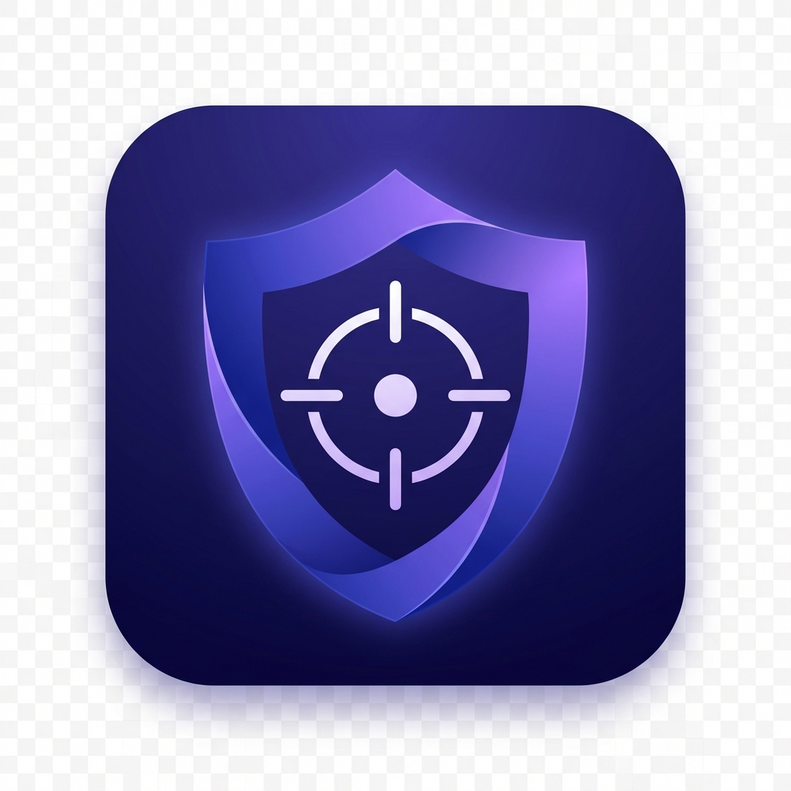

# FocusGuard

  

FocusGuard is a minimal, privacy-focused Android application designed to help you regain control over your attention. It acts as an intelligent shield against distracting notifications, allowing you to filter out noise while ensuring you never miss what's truly creating.

The philosophy is simple: **Focus without anxiety.** By effectively categorizing your notifications and providing a calm, determinate focus timer, FocusGuard helps you enter a state of deep work with confidence.

## App Overview

**[Insert Screenshots of 1. Home Screen (Focus OFF), 2. Focus Screen (Focus ON + Timer), 3. Notification List]**

These screenshots demonstrate the calm UI and the clear distinction between Focus states.

---

## Key Features

- **Smart Focus Mode**: Actively blocks notifications from "Unknown" and "Spam" senders while you focus.
- **Intelligent Classification**:
    - **Primary**: Important but non-urgent messages (allowed).
    - **VIP**: Critical contacts that always bypass Focus Mode (e.g., family, emergency).
    - **Spam**: Automated or unwanted messages (suppressed).
    - **Unknown**: New senders are held here until you classify them.
- **Clean Focus Timer**: A calm, circular progress indicator that tracks your session duration without inducing stress.
- **Milestone Reassurance**: Optional, non-intrusive notifications every 2 hours to celebrate long focus sessions.
- **Quiet Session Summary**: A subtle summary card appears when you end a session—no celebratory noise, just facts.
- **Immediate Controls**: Classify senders directly from the list with instant feedback and "Undo" support.
- **Tactile Feedback**: Gentle haptic confirmation when toggling Focus Mode.

---

## How FocusGuard Works

### Focus Lifecycle
1.  **Start Details**: Toggle the switch to enter Focus Mode. You'll feel a subtle haptic "click".
2.  **During Focus**: 
    - Notifications from **VIP** and **Primary** apps/contacts get through.
    - **Unknown** and **Spam** notifications are silently intercepted and stored in the app for later review.
    - A circular timer visualizes your progress towards a 2-hour milestone.
3.  **End Details**: Turn off Focus Mode to see a quiet summary of your total focus time for the day.

### Classification System
FocusGuard uses a 4-tier system to organize your digital life:
- **Unknown** (Default): New senders appear here. You can easily move them to Primary, VIP, or Spam.
- **VIP**: These override all filters. Use this for your partner, boss, or critical alerts.
- **Primary**: Good for regular apps (Calendar, Slack) that you want to see but aren't emergencies.
- **Spam**: These are hidden from your main feed.

---

## Permissions & Privacy

FocusGuard requires a single, powerful permission to function:

-   **Notification Access (`BIND_NOTIFICATION_LISTENER_SERVICE`)**: 
    -   *Why?* To intercept, read, and dismiss notifications on your behalf.
    -   *Privacy*: All processing happens **locally on your device**. No data is ever sent to the cloud.

---

## Tech Stack

FocusGuard is built with modern Android development practices:

-   **Language**: Kotlin
-   **UI Framework**: Jetpack Compose (Material 3)
-   **Architecture**: MVVM (Model-View-ViewModel)
-   **Local Database**: Room Persistence Library
-   **Background Work**: WorkManager (for Milestone checks)
-   **System Integration**: `NotificationListenerService`, `BroadcastReceiver`

---

## Build & Run Instructions

### Prerequisites
-   Android Studio Koala or newer.
-   JDK 11 or higher.
-   Device/Emulator running **Android 8.0 (Oreo)** or higher (minSdk 26).

### Steps
1.  Clone the repository.
2.  Open in Android Studio.
3.  Sync Gradle Project.
4.  Run on a device or emulator.
5.  **Important**: On first launch, you must grant **Notification Access** when prompted by the app.

---

## Project Status

**Current Status**: Functional Prototype / MVP

The core functionality (Focus Mode, Filtering, Timer, Milestones) is fully implemented and usable. The app is stable for daily use but is primarily a demonstration of advanced Android notification handling and local data management.
